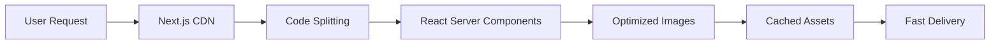

<div align="center">

# 🚀 Kunj Mungalpara's Portfolio

### *Where Design Meets Innovation*

<p align="center">
  <strong>🎨 Stunning 3D Graphics</strong> • <strong>⚡ Blazing Performance</strong> • <strong>🌐 Fully Responsive</strong>
</p>

<!-- Badges Row 1: Project Status & Live Demo -->
<p align="center">
  <a href="https://portfolio-ruby-iota-47.vercel.app">
    
  </a>
  <a href="https://portfolio-ruby-iota-47.vercel.app">
    
  </a>
  <a href="./LICENSE">
    
  </a>
</p>

<!-- Badges Row 2: GitHub Stats -->
<p align="center">
  <a href="https://github.com/kunj24/portfolio/stargazers">
    
  </a>
  <a href="https://github.com/kunj24/portfolio/network/members">
    
  </a>
  <a href="https://github.com/kunj24/portfolio/watchers">
    
  </a>
</p>

<!-- Badges Row 3: Repository Analytics -->
<p align="center">
  
  
  
</p>

<!-- Badges Row 4: Technology Stack -->
<p align="center">
  
  
  
  
</p>

<!-- Badges Row 5: Activity Stats -->
<p align="center">
  
  
  
</p>

<br/>

<!-- Repository Analytics Dashboard -->
<table>
<tr>
<td align="center" width="50%">
  
### 📊 Repository Statistics
  


</td>
<td align="center" width="50%">

### 🔥 Most Used Languages


</td>
</tr>
</table>

<!-- Repository Preview Card -->
<p align="center">
  <a href="https://github.com/kunj24/portfolio">
    
  </a>
</p>

<!-- Activity Graph -->
<p align="center">
  
</p>

<!-- Streak Stats -->
<p align="center">
  
</p>

<br/>

<!-- Website Preview -->
<a href="https://portfolio-ruby-iota-47.vercel.app">
  
</a>

<br/><br/>

An immersive digital portfolio showcasing cutting-edge web technologies, stunning 3D graphics, and seamless UX. Built for developers who demand excellence.

<br/>

### 🎯 Quick Links

**[🌟 Live Demo](https://portfolio-ruby-iota-47.vercel.app)** • **[📖 Get Started](#-quick-start)** • **[🎨 Features](#-features-overview)** • **[🚀 Deploy](#-deployment)** • **[🐛 Issues](https://github.com/kunj24/portfolio/issues)**

</div>

## 🎯 Why This Portfolio Stands Out

<div align="center">

| 🌟 Feature | 💡 Benefit | 🎨 Visual Impact |
|------------|-----------|------------------|
| **3D Interactive Hero** | Captivate visitors instantly | Real-time Three.js graphics |
| **8 Custom Cursors** | Unique desktop experience | Neon, Particle, Magnetic, Liquid |
| **Cyberpunk Preloader** | Engaging 15-20s loading | Matrix + Sound waves + 3D logo |
| **Performance First** | 95+ Lighthouse score | < 1s FCP, < 2s LCP |
| **Mobile Optimized** | Pixel-perfect responsive | Adaptive components & effects |
| **Dark/Light Themes** | User preference support | Smooth transitions |
| **100% TypeScript** | Zero runtime errors | Full type safety |
| **One-Click Deploy** | Instant production ready | Vercel/Netlify integration |

</div>

---

## ✨ Features Overview

<table>
<tr>
<td width="50%" valign="top">

### 🎨 **Visual Excellence**

- 🌌 **3D Hero Section** - Interactive Three.js scene with animated meshes
- 🎭 **8 Custom Cursors** - Neon, Particle, Magnetic, Liquid & more (desktop)
- ⚡ **Cyberpunk Preloader** - Matrix rain, sound waves, 3D rotating logo
- 🌈 **Dynamic Effects** - Chroma grid, magnetic buttons, hover animations
- 🎬 **GSAP Animations** - Professional scroll-triggered motion graphics
- 🌓 **Theme System** - Smooth dark/light mode transitions with persistence

</td>
<td width="50%" valign="top">

### ⚡ **Performance & Tech**

- 🚀 **Next.js 15** - Latest App Router with React Server Components
- 📦 **Smart Bundling** - Automatic code splitting & tree shaking
- 🖼️ **Image Optimization** - Next/Image with lazy loading
- 💯 **95+ Lighthouse** - Optimized for Core Web Vitals
- 🔒 **Type-Safe** - 100% TypeScript with strict mode
- 📱 **Mobile-First** - Responsive design with touch optimizations

</td>
</tr>
<tr>
<td width="50%" valign="top">

### 🎯 **Content Sections**

- 👤 **About** - Animated text reveals with word-by-word effects
- 💼 **Projects** - 6 showcase projects with live demos & GitHub links
- 🛠️ **Skills** - 18+ technologies with animated skill bars & stats
- 🎓 **Education** - Timeline cards with hover effects & achievements
- 🏆 **Certifications** - Digital certificates with verification links
- 📬 **Contact** - Working form with EmailJS integration

</td>
<td width="50%" valign="top">

### 🎪 **Interactive Elements**

- 🎯 **Scroll Progress** - Animated progress bar with section tracking
- 🧭 **Smart Navigation** - Sticky header with blur effect
- 💫 **Ripple Effects** - Touch/click feedback animations
- 🎨 **Floating Elements** - Ambient animated decorations
- ⌨️ **Keyboard Navigation** - Full accessibility support
- 🔄 **Smooth Scrolling** - Hardware-accelerated page transitions

</td>
</tr>
</table>

---

## 🛠️ Technology Stack

<div align="center">

### **Core Framework**


### **Styling & UI**


### **3D Graphics & Animation**


### **Developer Experience**


</div>

### 📚 Core Dependencies

```json
{
  "dependencies": {
    "next": "15.5.4",
    "react": "19.1.0",
    "typescript": "^5",
    "@react-three/fiber": "^9.3.0",
    "@react-three/drei": "^10.7.6",
    "three": "^0.180.0",
    "gsap": "^3.13.0",
    "framer-motion": "^12.23.22",
    "tailwindcss": "^4",
    "@emailjs/browser": "^4.4.1"
  }
}
```

---

## 🚀 Quick Start

### 📋 Prerequisites

Ensure you have these installed before proceeding:

| Tool | Version | Download |
|------|---------|----------|
| **Node.js** | 18.x or higher | [Download](https://nodejs.org/) |
| **Package Manager** | npm / yarn / pnpm | Included with Node.js |
| **Git** | Latest | [Download](https://git-scm.com/) |

### 🛠️ Installation Steps

<details open>
<summary><b>📥 Step 1: Clone the Repository</b></summary>

```bash
# Clone via HTTPS
git clone https://github.com/kunj24/portfolio.git

# Or clone via SSH
git clone git@github.com:kunj24/portfolio.git

cd portfolio
```

</details>

<details open>
<summary><b>📦 Step 2: Install Dependencies</b></summary>

```bash
# Using npm (recommended)
npm install

# Or using yarn
yarn install

# Or using pnpm (fastest)
pnpm install
```

</details>

<details open>
<summary><b>⚙️ Step 3: Environment Configuration</b> (Optional)</summary>

Create a `.env.local` file for EmailJS contact form:

```env
# EmailJS Configuration (Get free credentials at emailjs.com)
NEXT_PUBLIC_EMAILJS_SERVICE_ID=your_service_id
NEXT_PUBLIC_EMAILJS_TEMPLATE_ID=your_template_id
NEXT_PUBLIC_EMAILJS_PUBLIC_KEY=your_public_key
```

> 💡 **Note:** Contact form will be disabled if credentials are not provided. The rest of the portfolio works perfectly without them.

</details>

<details open>
<summary><b>🚀 Step 4: Start Development Server</b></summary>

```bash
npm run dev
```

```
✔ Ready in 2.5s
○ Local:    http://localhost:3000
```

</details>

<details open>
<summary><b>🌐 Step 5: Open in Browser</b></summary>

Visit **[http://localhost:3000](http://localhost:3000)**

🎉 **Success! Your portfolio is now running at localhost:3000!**

</details>

---

### 📦 Available Commands

<div align="center">

| Command | Description | Usage |
|---------|-------------|-------|
| `npm run dev` | Start development server | Hot reload at localhost:3000 |
| `npm run build` | Build for production | Optimized production bundle |
| `npm run start` | Start production server | Run built application |
| `npm run lint` | Run ESLint checks | Find code issues |

</div>

---

## 📁 Project Structure

```
portfolio/
│
├── 📂 public/                    # Static assets
│   └── 📂 images/               # Project images and media
│
├── 📂 src/
│   ├── 📂 app/                  # Next.js App Router
│   │   ├── globals.css         # Global styles and CSS variables
│   │   ├── layout.tsx          # Root layout component
│   │   └── page.tsx            # Homepage
│   │
│   ├── 📂 components/
│   │   ├── 📂 3d/              # Three.js 3D components
│   │   │   ├── Hero3D.tsx     # 3D hero scene
│   │   │   └── Scene3D.tsx    # 3D scene wrapper
│   │   │
│   │   ├── 📂 sections/        # Page sections
│   │   │   ├── HeroSection.tsx
│   │   │   ├── AboutSection.tsx
│   │   │   ├── SkillsSection.tsx
│   │   │   ├── ProjectsSection.tsx
│   │   │   ├── EducationSection.tsx
│   │   │   ├── CertificationsSection.tsx
│   │   │   └── ContactSection.tsx
│   │   │
│   │   └── 📂 ui/              # Reusable UI components
│   │       ├── AnimatedMesh.tsx
│   │       ├── CustomCursor.tsx
│   │       ├── Navigation.tsx
│   │       ├── ThemeToggle.tsx
│   │       └── ... (15+ components)
│   │
│   ├── 📂 hooks/               # Custom React hooks
│   │   ├── use-cursor.tsx     # Cursor state management
│   │   ├── use-theme.tsx      # Theme management
│   │   ├── useGSAP.ts         # GSAP animations
│   │   └── useScrollAnimation.ts
│   │
│   ├── 📂 lib/                 # Utility functions
│   │   └── utils.ts           # Helper utilities
│   │
│   └── 📂 types/               # TypeScript definitions
│       └── index.ts           # Type declarations
│
├── 📄 .env.local               # Environment variables (create this)
├── 📄 next.config.ts           # Next.js configuration
├── 📄 tailwind.config.ts       # Tailwind CSS config
├── 📄 tsconfig.json            # TypeScript config
└── 📄 package.json             # Dependencies
```

---

## 🎨 Customization Guide

### 🔧 Quick Customization Checklist

<details>
<summary><b>📝 1. Update Personal Information</b></summary>

<br/>

#### 👤 Hero Section
Edit [`src/components/sections/HeroSection.tsx`](src/components/sections/HeroSection.tsx):
```typescript
// Update these values
const name = "Your Name";
const title = "Your Title";
const description = "Your description";
const resumeLink = "your-resume-url";
```

#### 📖 About Section
Edit [`src/components/sections/AboutSection.tsx`](src/components/sections/AboutSection.tsx):
```typescript
// Modify your professional summary and bio
const aboutText = "Your story here...";
```

#### 🛠️ Skills Section  
Edit [`src/components/sections/SkillsSection.tsx`](src/components/sections/SkillsSection.tsx):
```typescript
const skills = [
  { name: "Your Skill", level: 90, icon: YourIcon },
  // Add more skills...
];

// Update stats
const stats = [
  { number: "20+", label: "Technologies" },
  { number: "10+", label: "Projects" },
  // ...
];
```

#### 💼 Projects Section
Edit [`src/components/sections/ProjectsSection.tsx`](src/components/sections/ProjectsSection.tsx):
```typescript
const projects = [
  {
    title: "Your Project",
    description: "Project description",
    technologies: ["Tech1", "Tech2"],
    github: "your-github-url",
    live: "your-live-demo-url",
    image: "/images/your-project.png"
  },
  // Add more projects...
];
```

#### 🎓 Education Section
Edit [`src/components/sections/EducationSection.tsx`](src/components/sections/EducationSection.tsx):
```typescript
// Update your degrees and achievements
```

</details>

<details>
<summary><b>🎨 2. Customize Theme Colors</b></summary>

<br/>

#### 🌈 Update Color Palette
Edit [`src/app/globals.css`](src/app/globals.css):
```css
:root {
  --primary: #2ee6c1;      /* Teal accent */
  --accent: #ff4da6;       /* Magenta accent */
  --background: #0f1724;   /* Dark background */
  --card: #0b1220;         /* Card background */
}
```

#### 🎭 Tailwind Configuration
Edit [`tailwind.config.ts`](tailwind.config.ts):
```typescript
module.exports = {
  theme: {
    extend: {
      colors: {
        primary: '#2ee6c1',
        accent: '#ff4da6',
        // Add your custom colors
      }
    }
  }
}
```

</details>

<details>
<summary><b>📧 3. Configure Contact Form</b></summary>

<br/>

1. 📝 Sign up at [EmailJS](https://www.emailjs.com/)
2. ⚙️ Create an email service (Gmail/Outlook/etc.)
3. 📄 Create an email template
4. 🔑 Copy your credentials
5. 📂 Add to `.env.local` file
6. ✅ Test the contact form

</details>

<details>
<summary><b>🖼️ 4. Add Your Images</b></summary>

<br/>

1. 📁 Place images in `public/images/`
2. 🔗 Reference in components:

```typescript
import Image from 'next/image';

<Image 
  src="/images/your-image.jpg" 
  alt="Description"
  width={800}
  height={600}
  className="rounded-lg"
/>
```

**Supported formats:** JPG, PNG, WebP, AVIF

</details>

<details>
<summary><b>🖱️ 5. Customize Cursor Styles</b></summary>

<br/>

Edit [`src/components/ui/CursorSystem.tsx`](src/components/ui/CursorSystem.tsx):

```typescript
// Available cursor variants:
// 'none', 'default', 'neon', 'particle', 'magnetic', 'morphing', 'geometric', 'liquid'

<CustomCursor variant="neon" /> // Change to any variant
```

</details>

---

## 🌐 Deployment

<div align="center">

### **Deploy Your Portfolio in Minutes** 🚀

Choose your preferred platform and go live instantly!

</div>

### ⚡ Vercel (Recommended)

**Why Vercel?**
- ✅ Zero configuration required
- ✅ Automatic HTTPS & CDN
- ✅ Instant Git integration
- ✅ Free for personal projects
- ✅ Auto-deploys on every push

**Quick Deploy:**

[](https://vercel.com/new/clone?repository-url=https://github.com/kunj24/portfolio)

**Manual Deployment:**

```bash
# Step 1: Push your code to GitHub
git push origin main

# Step 2: Import to Vercel
# - Visit vercel.com/new
# - Import your GitHub repository
# - Configure environment variables (if using EmailJS)
# - Click Deploy

# Your site is live! 🎉
```

**Environment Variables in Vercel:**
1. Go to Project Settings → Environment Variables
2. Add your EmailJS credentials
3. Redeploy for changes to take effect

---

### 🌊 Netlify

**Quick Deploy:**

[](https://app.netlify.com/start/deploy?repository=https://github.com/kunj24/portfolio)

**Build Configuration:**
- **Build Command:** `npm run build`
- **Publish Directory:** `.next`
- **Node Version:** 18.x

---

### 🐳 Docker Deployment

```dockerfile
FROM node:18-alpine AS deps
WORKDIR /app
COPY package*.json ./
RUN npm ci

FROM node:18-alpine AS builder
WORKDIR /app
COPY --from=deps /app/node_modules ./node_modules
COPY . .
RUN npm run build

FROM node:18-alpine AS runner
WORKDIR /app
ENV NODE_ENV production
COPY --from=builder /app/public ./public
COPY --from=builder /app/.next/standalone ./
COPY --from=builder /app/.next/static ./.next/static
EXPOSE 3000
ENV PORT 3000
CMD ["node", "server.js"]
```

**Docker Commands:**
```bash
# Build image
docker build -t my-portfolio .

# Run container
docker run -p 3000:3000 my-portfolio
```

---

## 📊 Performance

<div align="center">

### 🏆 Lighthouse Scores

<table>
<tr>
<td align="center" width="25%">

<br/>
<strong>⚡ Performance</strong>
</td>
<td align="center" width="25%">

<br/>
<strong>♿ Accessibility</strong>
</td>
<td align="center" width="25%">

<br/>
<strong>💡 Best Practices</strong>
</td>
<td align="center" width="25%">

<br/>
<strong>🔍 SEO</strong>
</td>
</tr>
</table>

<br/>

### ⚡ Core Web Vitals

| Metric | Score | Status |
|--------|-------|--------|
| **First Contentful Paint (FCP)** | < 1.0s | 🟢 Excellent |
| **Largest Contentful Paint (LCP)** | < 2.0s | 🟢 Excellent |
| **Cumulative Layout Shift (CLS)** | < 0.1 | 🟢 Excellent |
| **Time to Interactive (TTI)** | < 2.5s | 🟢 Excellent |
| **Total Blocking Time (TBT)** | < 150ms | 🟢 Excellent |

### 🚀 Optimization Techniques



**Key Optimizations:**
- ✅ Automatic code splitting & tree shaking
- ✅ Image optimization with Next/Image
- ✅ React Server Components
- ✅ CSS-in-JS with zero runtime
- ✅ Font optimization
- ✅ Lazy loading for 3D components
- ✅ Hardware-accelerated animations

</div>

---

## 🤝 Contributing

Contributions are what make the open-source community an amazing place to learn, inspire, and create! Any contributions you make are **greatly appreciated**. 🙏

### 🌟 How to Contribute

<table>
<tr>
<td>

**1️⃣ Fork the Project**
```bash
# Click the Fork button at top right
```

</td>
<td>

**2️⃣ Create Branch**
```bash
git checkout -b feature/AmazingFeature
```

</td>
</tr>
<tr>
<td>

**3️⃣ Commit Changes**
```bash
git commit -m 'Add AmazingFeature'
```

</td>
<td>

**4️⃣ Push to Branch**
```bash
git push origin feature/AmazingFeature
```

</td>
</tr>
<tr>
<td colspan="2" align="center">

**5️⃣ Open a Pull Request**

</td>
</tr>
</table>

### 📋 Development Guidelines

<div align="center">

| Rule | Description |
|------|-------------|
| 📝 **Code Style** | Follow existing patterns and conventions |
| 💬 **Commit Messages** | Use clear, descriptive commit messages |
| 🧪 **Testing** | Test thoroughly before submitting |
| 📖 **Documentation** | Update docs for new features |
| 🎨 **Design** | Match existing UI/UX patterns |

</div>

---

## 📄 License

Distributed under the **MIT License**. See [`LICENSE`](LICENSE) for more information.

This means you can:
- ✅ Use commercially
- ✅ Modify
- ✅ Distribute
- ✅ Private use

---

## 📧 Contact & Connect

<div align="center">

**Kunj Mungalpara** | Full-Stack Developer & ML Enthusiast

[](https://portfolio-ruby-iota-47.vercel.app)
[](https://github.com/kunj24)
[](https://linkedin.com/in/kunj-mungalpara)
[](mailto:kunj.mungalpara@example.com)

**💬 Open for collaborations, freelance work, and exciting opportunities!**

</div>

---

## 💖 Support This Project

<div align="center">

If you find this project helpful, consider:

⭐ **Star this repository** to help others discover it

🍴 **Fork it** to create your own version

🐛 **Report bugs** to help improve it

✨ **Share it** with your developer community

[](https://github.com/kunj24/portfolio/stargazers)
[](https://github.com/kunj24/portfolio/fork)

</div>

---

## 🙏 Acknowledgments & Credits

Special thanks to these incredible open-source projects:

<div align="center">

| Technology | Purpose |
|-----------|---------|
| [Next.js](https://nextjs.org/) | React framework for production |
| [Three.js](https://threejs.org/) | 3D graphics library |
| [React Three Fiber](https://docs.pmnd.rs/react-three-fiber) | React renderer for Three.js |
| [GSAP](https://greensock.com/) | Professional animation library |
| [Framer Motion](https://www.framer.com/motion/) | Motion library for React |
| [Tailwind CSS](https://tailwindcss.com/) | Utility-first CSS framework |
| [Lucide Icons](https://lucide.dev/) | Beautiful consistent icons |
| [EmailJS](https://www.emailjs.com/) | Email service integration |
| [Vercel](https://vercel.com/) | Deployment & hosting platform |

</div>

---

<div align="center">

## 📜 License

This project is licensed under the **MIT License** - see the [LICENSE](LICENSE) file for details.

**You are free to:**
- ✅ Use commercially
- ✅ Modify and adapt
- ✅ Distribute
- ✅ Use privately

**Conditions:**
- 📄 Include copyright notice
- 📄 Include license text

---

<br/>

### 🌟 If you found this useful, give it a star!

<br/>

[](https://star-history.com/#kunj24/portfolio&Date)

<br/>

Made with 💙 and ☕ by [Kunj Mungalpara](https://github.com/kunj24)

**© 2026 Kunj Mungalpara. All Rights Reserved.**

<br/>

[](https://vercel.com)
[](https://nextjs.org)
[](https://react.dev)
[](https://threejs.org)

<br/>

[⬆ Back to Top](#-kunj-munpalgaras-portfolio)

</div>
